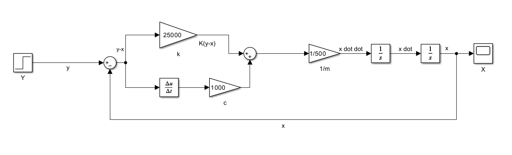
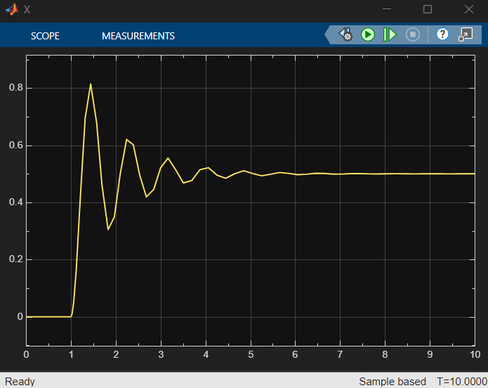

# 1-DOF Quarter-Car Suspension Model

## Overview

This section contains the first-stage development of the quarter-car suspension simulation.

The system is modeled as a single-degree-of-freedom mass-spring-damper system in MATLAB Simulink. The model is used to study the transient response of a vehicle body subjected to a road displacement input.

## Model

The 1-DOF system consists of:

- Vehicle mass: 500 kg
- Suspension stiffness: 25,000 N/m
- Suspension damping: 1,000 N·s/m
- Road displacement input

The governing equation is:

m*ẍ = k(y-x) + c(ẏ-ẋ)

where:

- x = vehicle body displacement
- y = road displacement
- m = vehicle mass
- k = suspension stiffness
- c = damping coefficient

## Simulink Implementation

The mathematical model is implemented using:

- Step input
- Sum blocks
- Gain blocks
- Derivative block
- Integrators
- Scope

The relative displacement is calculated as:

y - x

and the relative velocity is obtained by differentiating this displacement.

The spring and damping forces are then combined and divided by the vehicle mass to obtain acceleration.

## Simulation

The model is subjected to a step road disturbance and simulated for 10 seconds.

The resulting vehicle displacement is observed using a Simulink Scope.
### Simulink Model

## Results

The simulation produces a stable, damped oscillatory response following the road disturbance. The oscillations decrease with time due to the damping force, eventually reaching a steady-state displacement.
### Simulation Results

## Future Development

The 1-DOF model serves as the foundation for the next stage of development: a 2-DOF quarter-car model incorporating sprung mass, unsprung mass, suspension dynamics, and tire stiffness.
